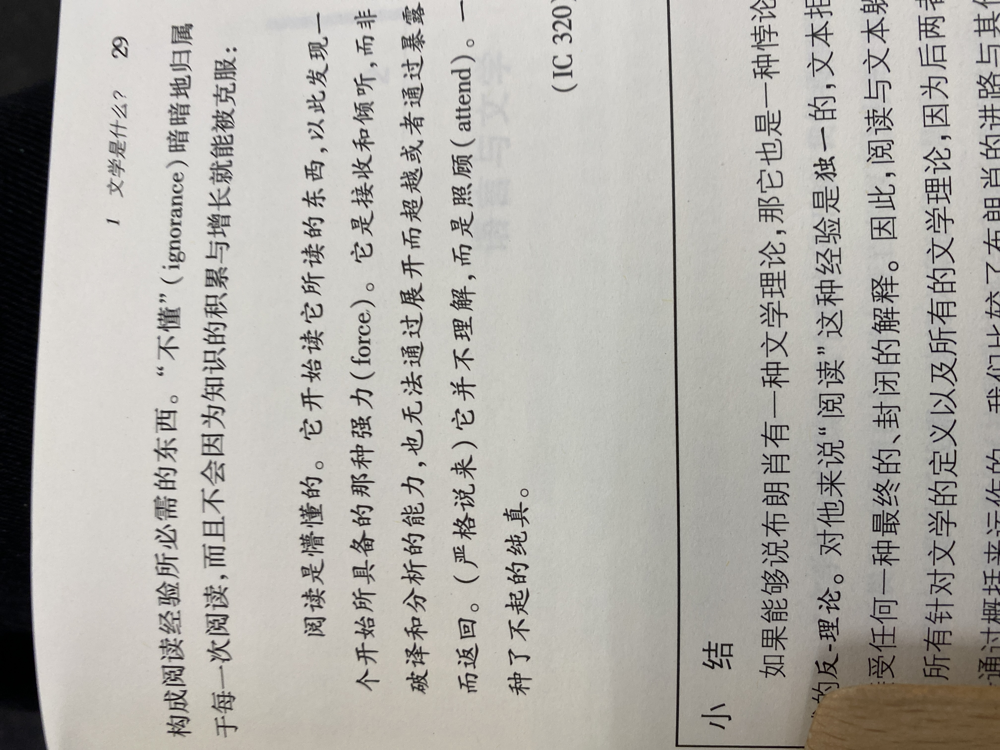
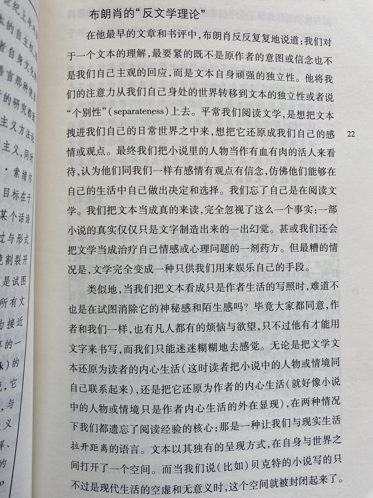
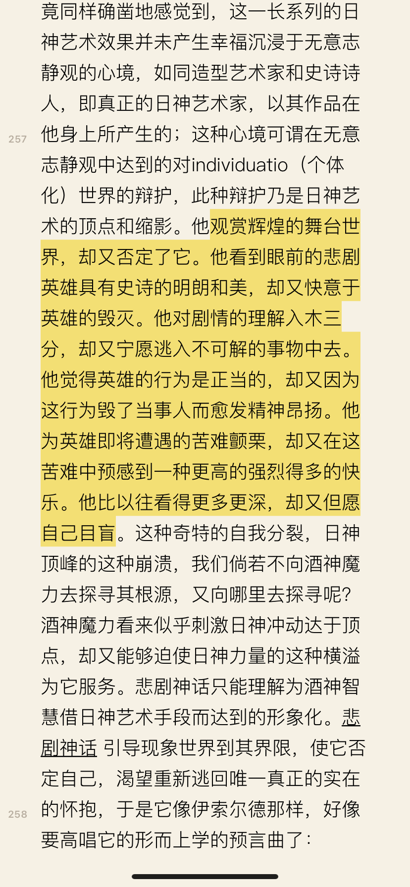
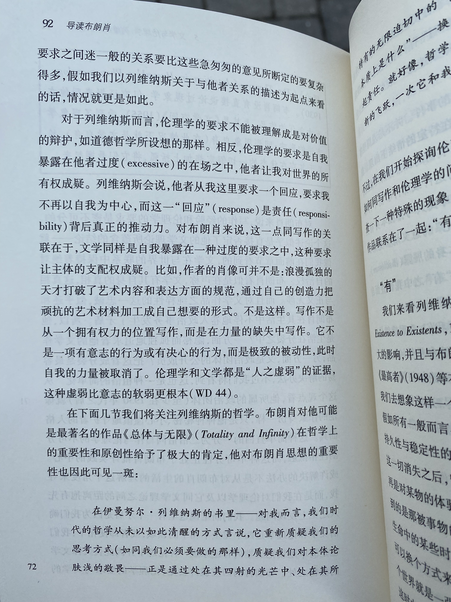

7/17

好的小说要能建立矛盾，情节中的，人与人间的，观念之上的；矛盾引出问题，小说便有了价值。

9/3

我生活在各种各样的气泡中，一曰懒惰，一曰刻苦，一曰阴郁。身处名为刻苦的气泡中时，似乎自然而然的就可以不停的学习，此时好。而身处名为懒惰的气泡中时，我能听到来自意识的某个地方传出的焦急，不甘，和渴望脱身而出的呼喊，可其他部分却如瘫痪了一般。再怎么会讲道理也于事无补。实际上，当我希冀所谓道理来把我拉出泥潭时，大概也显露出自身的懒惰吧。

浪漫曲。朋友说，如果爱一个人，就把它分享给她。太对了。

9/10

我坚信人类文明是以牺牲原始的本能而创造出来的。

想写一个故事，一个以爱情的开始为结局的故事

9/18

我所羡慕的人大概不会羡慕自己

下雨天 影子都会缺席 真是非常文艺的说法了...  雨天，缺席未至的影子，很讨喜

9/25

城市里，感觉整个人都臃肿了起来...

偏激就像一柄锋利的刀；偏激和天才的结合才能破开相对主义的表皮，进入更深层的空间里去；寻常人无论多么博学，或有些天资，最终也只能在表面徘徊，说些挑不出毛病却毫无用处的话。

10/18

现代文化里充斥着个人主义的自我审视与自我陶醉；对于问题，我们“提及”，却无“视角”;这也是我的问题，仅仅满足提问题，对于答案，我自认没有能力给出的同时，也限制了自己的进步

10/24

相对主义就像一个政客，它每个人都希望讨好，哪一边都不想得罪，因此它不会有自己的观点，也不会有任何作用。

仿佛现代艺术家在创作现代艺术前，该好好学一学哲学；否则以现代艺术重意不重型的特点来看，他们所希望传达的内容实在是太无趣了

大自然有种力量，一种让人不禁想消融进去的无边；这种感觉简直如呼吸般自然，算不上冲动，更别提悲与喜，如同清醒时进入一个梦一般

读着歌德，尼采，听着瓦格纳，巴赫，贝多芬的德国人掀起了二战；

不得不怀疑音乐，文学与哲学真能让人更“好”吗？即便避开天才所保有的偏激，艺术与哲学也没有让人朝“超人”的方向迈进

我热衷于提出问题，但我似乎仅仅满足于此了，我对他们不负责；实际上，若能进一步作出思考与研究，便有可能得出我的答案，形成真正的观点，但我由于懒惰与一定程度的怯懦，却没能如此，归根究底还是没有把思考作为某种承载生命所必须的东西，更别提如维特根斯坦一样，把它当作某种与生俱来的责任来对待了，虽然我是与天才边都沾不上的。

所谓宗教性，是让人意识到他们自己不配

10/29

小李老师常说，记得敢于去相信。我很喜欢这句“祝福”，因为相信是我非常缺乏的能力，大概也是很多当代人所不具备的，一种国人现代性的缺失... 无法相信，因而缺少看法，没有信念....

设想一个场景，站在窗前，外面密密麻麻的楼房，心中突然有了一阵感慨，而后进一步想：这千千万万的灯火，人家，都与我有关。
这进一步的联想，听起来就很浪漫主义。
浪漫主义包括： 刻奇，宗教浪漫主义，民族浪漫主义
可否理解为，虚假的感性？

罪无法用诗来救赎

1/8

设想以下对话，一说，我们说不应将自己固定在某个价值观，某个人生观之上，而应该兼容并济，听多家之言；又说，若此般，则人就会成为无根之萍，无所依靠，无所信，极易陷入虚无主义。
因此，最好便是适度而行，依百家而言，形成自己的观点，遇到新视角时又能仔细倾听与反思。
这样的观点，放之四海而皆准。适度，上到国家政治，下到做菜用料，都可用。
矛盾之处，便在于此，一方面，这样的观点可谓毫无用处，只能是用来和稀泥，不仅会终止讨论，也会让人懒于思考，直接得出“适中才好”的结论。但另一方面，若不如此，但理性却告诉我们，确实适中才是“对的”。

认为一件事是“善”，需要给事物的完满程度排序。因为现实中没有完满的事，也自然没有完满的“善”。

不可妄称耶和华你的神的名，不要随意以道德的名义为自己提供理由；当无论怎样选择都是恶时，就应当食下苦果；自以为为善所找的理由，只是欺骗自己，这是很大的虚伪

1/12

布朗肖


1/20
我们似乎迷恋上用很严重的词来形容自己的“凄惨”；一方面，这可以使我们在不自觉的“比惨”中获胜，另一方面，如此的“凄惨”也可以掩盖我们的错。

2/1
在拥有足够的经历之前，所有自认为的感悟，顿悟，都是自欺的。

2/3
相对主义的一大弊端，便是让许多不好的，无价值的，都具有了正当性。

许多令人困惑的诡辩都只是语言游戏，“没有绝对本身就是一种绝对”，诸如此类。

2/4
不要妄下判断，更不要因为害怕偏见与批评而不敢下判断。不要轻易下的是对外的判断，需要下的是对内心的 — 这样才能形成想法，改进或延伸。

2/7
与金钱相连的知识项目几乎总会败坏。知识付费必然要迎合，必然无法平等。
拿人手短，特指金钱关系，可为什么如师生，父子，此类的亏欠与付出关系要比欠钱与还钱的关系要好那么多呢？

2/10
我们认为道理不过一句话，剩余的全是实践；可实际上，越能放在一句话里的道理越对我们无用，说理仍是有帮助的.

3/10
笑忘书：

“但是，她真的在听吗？还是她只是在看，如此专注、如此安静地看？我不知道，这不重要。重要的是她从不打断人家。您知道两个人聊天一般是怎么回事。一个人说着，另一个人就打断他：“对，我也是这样，我……”然后就开始谈自己，直到前一个人轮到自己终于能插上话：“对，我也是这样，我……”
“对，我也是这样，我……”这句话看上去像是表示赞同的一种回应，是把别人的思考继续下去的一种方式，其实，这不过是一个圈套：实际上，它是一种以暴制暴式的反抗，是给我们自己的耳朵解除奴役并强行占据他人耳朵的一种努力。因为人在其同类中所度过的一生，只是占据他人耳朵的一场战斗。塔米娜之所以得人心的所有秘诀，就在于她不想谈她自己。她没有抵抗就接受占据自己耳朵的人，她从来不说：“对[…]”

Excerpt From
笑忘录
米兰·昆德拉
This material may be protected by copyright.

网上以留言形式的交流是戾气最重的交流方式。留言只能展现留言者极片面的想法，而一旦这想法与回复者脑海中所对应的想法不符，该留言者就会被回复者全部否定
自媚是网络交流中很大的龌龊，一旦对话涉及到道德话题，如民族，女权，人权，一旦交流中的某一方认为自己在道德上是高尚的，便会不自禁的义愤填膺起来。在这义愤填膺中，难说多少是发自内心的，出于对某事的信念的真感情，还是道德快感。而在留言形式的交流中，在打字时，实际是个与自己交流的过程，虚伪的情感也就因此被放大。

真实的比修辞的、艺术的，高在哪里？

“骄傲这个词，只要被恰如其分地说出来，就不再可笑，反而是一个具有灵性的高贵的词。”

Excerpt From
笑忘录
米兰·昆德拉
This material may be protected by copyright.

3/19
强行催生出的情感都是自媚的，虚伪的，不真实的

3/26
浪漫乐曲如肖邦，李斯特，情感表达仍不易太过。最重要的还是整个乐曲的“harmony”。钢琴曲就应如水般流畅，自然，表达不应该夸张

4/21

和维特根斯坦不谋而合

布朗肖强调文学所创造出来的独立空间。
我也认为，在阅读时过多的代入自己，或将人物带入现实世界会分蚀掉文学的魅力，但布朗肖所强调的独立的不应掺杂现实的空间，与比如游戏里的虚构又差别在哪呢？

布朗肖强调文学所创造出来的独立空间。
我也认为，在阅读时过多的代入自己，或将人物带入现实世界会分蚀掉文学的魅力，但布朗肖所强调的独立的不应掺杂现实的空间，与比如游戏里的虚构又差别在哪呢？

P18
文学文本的意义既不存在于作者心中，也不在文本自身之内，而存在于读者与文本的互动里。
而同时，文本又拒斥读者的占用。这绝非意味着它是无意义的。恰相反，这种拒斥正是它的意义所在，这种拒斥使它成为文学。另言之，一个文本之所以被称为文学，就是因为它说的比我们能够理解的更多。

布朗肖认为，能够保证一个文学文本奏效的最终条件恰恰是它始终无法达到应有的效果。

5/31
使人高贵的种种理论似乎有力量使那些生性高尚的人归于德性，但他们却没有能力去促收大多数人追求善和美。

哲学不提供理论

何为良好生活？
设想带薪年假的一次旅行。

要对善智慧，对恶天真

创造性是极其容易变成浪漫主义的想法。它不应该不是产生于酒神或梦神的强烈冲动；真正具有创造性的，是具有世界重启的能力的 — 如相对论，如苹果手机，如女权思想。真正的创造性应该是整体性的有意义的想象，使过去觉得理所当然的事情变得不再理所当然。

我做我的事，你做你的事，我有我的喜欢，你有你的喜欢，大家互不干涉。这是行不通的。
审美不仅是个人喜好。贝多芬与莫扎特，你喜欢莫扎特，我喜欢贝多芬，这没问题。但若说你喜欢贝多芬，我喜欢喊麦，我们的审美只是喜好不同，这就不能让人接受。
这里就有一个界限。对于这个界限，我们找不到量化的标准，但这不是这个“界限”不存在的理由。是谁制定了这样的界限呢？ 是权威。
我们一方面对权威谈之色变，一方面我们又安心处于最大的权威之下。对于人文方面的权威，人们对于意见相左的权威嫉恶如仇，群起而攻之，说是打倒权威，第二天就拿另一个权威去驳斥它并树立一个新的权威。而当这新的权威意见不同时，就再次重复

6/11

文字以至于文学的魅力在于其超越现实指物意义，超越概念的能力。

我们经常会想，人常自欺，唯有痛苦与死亡最真实。可似乎，围绕痛苦与死亡，人所产生的想法却是很容易自欺的。例如人在生活艰辛不顺时，便极易陷入叔本华的悲观主义，又或者陷入另一种浪漫主义，自欺地遐想痛苦（尤其流行孤独）所带来的某种魔力。

6/13

最流行的网络病，就是以道德的名义去审判他人。这是“知善恶”的弊端

现代人有可能只过自己的而不影响他人吗？
不可能。
所以不要遇事就推脱：这只是我个人行为/偏好/意见，与你无关。

世界意志是盲目的，是无意义的。 即便这个是真理，又如何呢？ 真理就是人的最高价值标准吗？世界本质是虚无的。抛开这句话本身，它还有何意义呢

6/15
我有一段时间觉得知道道理是不必要的：道理大家都懂，关键是懂了也不会做。现在想来，感觉若弄懂了道理以及其背后的一系列道理，那么会更心甘情愿的去执行，而不会觉得是某种行为准则需要强迫自己遵守一样。

6/16
今天提着行李箱和吉他准备坐地铁，楼梯很窄，我就等迎面走上来的人先走出楼梯。余光中那个人看起来很邋遢，很“不羁”的把楼梯上的垃圾往平台上扔。我只当他是如纽约所见的许多不正常人一样。走上来的时候他在说什么，我戴着耳机没听清，以为是不知所谓的自言自语，我刻意看向旁边。 然后我隐约听到“fall” ，才想到他是怕我滑倒。那一刻感觉非常糟。他怕我摔倒，我却刻意无视他。
这让我体会到，若非某人是真的恶意相向，那么对看似疯癫的这些人也应该心怀善意和共情。不正常的外表下时常是一颗善良的心。
父母会说，出门在外要谨慎陌生人。要精一点。
那我愿意做“傻傻“的那个

逻辑仿佛连起来了。康德的道德律令，道德只能作用于自己。长辈说的精，也只是因为自己的“善良”不能一次要求别人，而自己“善良”就会吃亏。但既然这善良不能要求别人，那这“吃亏”就是自然的。这时候难得不问“凭什么”。凭什么我善良却要吃亏？那么看吧，这潘多拉魔盒里飞出来的三个字，就是许多问题的来源。
因此就要宽恕和忍耐。如何做到呢？靠回想自己犯过的错。

6/23
维特根斯坦后期的转变，是否体现在：对于不可说的，不应保持沉默，而是不应去试图定义，而是通过具体实例来进行说明？

6/25
导读布朗肖：
p59
文学的承诺不在于拓宽我们的知识，也不在于帮助我们实现对世界的征服，相反，是要抵消人之生存在一个q实用世界里所遭受的异化
p60
文学是对可能世界的虚构性的，自由的发明—这是那些仅用来消遣时光的小说所带来的感觉，可实际上，文学的根本问题是：“我如何能够在语言中捕捉到那我为了言说而必须先将其驱除之存在？

6/29
如何辨别反省是否真诚？ 看该反省有没有让我不舒服

7/8
主要的矛盾…是对当下以及未来想象中的安定所感到的不舒适 — 我一直是习惯“迷茫”的感觉，像在雾气弥漫的路上不断前进摸索一样的感觉，而爱情是这途中很重要的一块路标。 迷茫的感觉，如我的文字，莫迪亚克，村上春树，三岛…

我想，我一直把爱情看得如此重要的原因，是不是在潜意识中，除了爱情之外没有别的真正于人生意义上的明确目标？

这里提到的，见证英雄受苦所产生的战栗，快感，是否与三岛的死亡美学暗合？清显病入膏肓去寻聪子时的受苦，两人爱情的煎熬，这些象征着日神文化光艳的外表，炙热的爱情，在攀向顶峰时也在逐步瓦解；再比如盖特路德里海因里希与盖特路德的爱情 — 在共情于书中角色的痛苦时，似乎确实会产生某种“快感”，他们与悲剧之注定的抗争，也体现了lo爱情之美，生命之鲜活与力量。

爱情似乎是我人生价值中最重要的一部分，似乎甚至高于音乐，文学，美术… 更别提社会贡献 我在作出贡献，帮助他人中获得快乐和满足感，但这不是我心中的“良好生活”，还差了一步。我的良好生活似乎必须在路上。而爱情却恰恰不能在路上，至少当下它给我的体验便是如此。似乎一段关系进入稳定期，需要开始考虑婚姻与终身的时候，我便会有这种感觉。可若不然呢？我不愿因上述这般而不断开始新的关系，每次分离都很难过，每次分离到现在还让我觉得难过。我在良好生活的途中停下来了，并不再思考和为良好生活了，似乎爱情延续下去，便让我停止如此思考，并开始专注事业，后代，给另一半和孩子提供优渥的生活环境，如此。
这二者的状态并非如水火互斥，也不似阴阳相生相克 — 用不同的路做类比恰当吗？ 好累，下次再想吧

7/23
就想，临死前，想到做了什么是不负此行的，那会是什么呢？不是赚钱，不是帮助他人，似乎也不可能是爱情，也想象不到有什么事业，音乐或者文学可能吗？还是说这并不是可欲的？

7/27
网络暴力，残忍年代…
不过话说回来，人在不论何时都喜欢在自以为正义时对他人进行道德审判，喜欢观看名人/英雄的坠落，再上去踩几脚。网络放大了这些声音
那么我，能避免这种劣质吗？
只是表面上的。
我能做到不在网上带节奏，被带节奏，但这可能只是因为我不怎么刷微博；我似乎做不到在对亲密关系中，不产生在自认为“正义”时对另一方所有的责备的情绪。

8/4
为什么难以找到兴趣？
可能只有极少一部分人是对任何事都缺乏兴趣，更多只是因为难以在某件事上深入下去，问题源自当代的信息泛滥，肤浅的各式各样的内容会影响人对某个点的探究

8/6

戏谑式语言与平民社会的勾连，这种“不认真”其实是对自我的保护，拒绝来自他人的指错；文学式语言被戏谑式语言替代，正是所谓“认真就输了”的感觉，这点其实并非当代特有。
为什么小资或文青在当下是个贬义词？当下的社会环境，发出的声音需要符合社会的迫切诉求，贴合迫切的社会矛盾，而文青温和的声音则是其反面。比如，在评价流浪地球是否为好电影时，我们评价其为好电影的原因是：体现了国产科幻电影的进步，以及爱国、民族精神的体现，而非从它的艺术表现手法切入；在评价小丑是否为好电影时，我们会说，小丑体现了社会的矛盾，代表了一大部分城市普通人民的迷茫，对社会不公无指向的抗议，因此是好电影。
文青这个概念，已经被文化消费掏空 — 已经不具有曾经的意义

反思自己，我自己想到自己弹琴不好，这没什么，但如果我在看到一个并非大师的“可比较”的同龄人弹的比我好时，是不是内心某个角落会悄悄地安慰自己：我不是认真的 呢？

技术规定了所有的问题，文化及其传播的问题，如同其他所有问题，政治动荡是没有必要的，社会结构的变动更是没有必要的。休谟为代表的当代实证主义观点，是不是与虚无主义极像？人最终实际上什么都理解不了，这个论点看似正确，实则却是一种概念的误用。
这也带来了另一种错误的观点，即鲁迅广为人知的谬用 — 人与人之间的悲欢并不相通。可实际真如此吗？
这种把名言警句滥用，符号化的过程，实际上阻止了对其真正意味的思考，